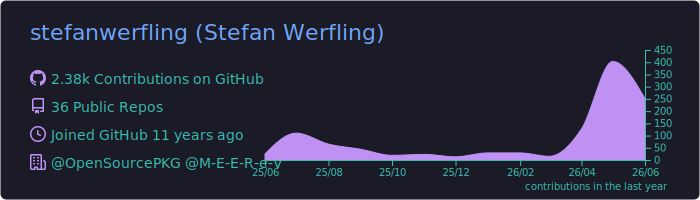
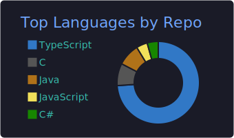
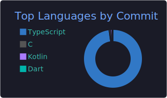
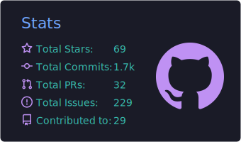
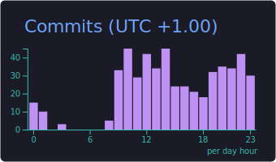

<div align="center">

<a href="https://github.com/stefanwerfling">
  
</a>

# Stefan Werfling

### Full-Stack Developer · Systems & Open Source

<p>
  
  
  
</p>

<a href="https://git.io/typing-svg">
  
</a>

<p>
  
  <a href="https://github.com/stefanwerfling?tab=followers"></a>
  <a href="https://github.com/stefanwerfling"></a>
</p>

</div>

---

## About me

```ts
const stefan = {
    role:        "Full-Stack Developer & Systems Engineer",
    nickname:    "Knicki",
    location:    "Germany",
    focus:       ["TypeScript", "Node.js", "C/C++", "Go", "Flutter"],
    currently:   ["FlyingFish", "NjsFsCrypt", "VTS Editor", "FigTree"],
    learning:    ["Rust-style ownership in Go", "LLM tooling", "FUSE internals"],
    fun_fact:    "I once wrote a Node.js binding to the ROHC C library — for fun.",
};
```

- Currently working on [FlyingFish](https://github.com/stefanwerfling/flyingfish), [NjsFsCrypt](https://github.com/stefanwerfling/njsfscrypt) and [VTS Editor](https://github.com/stefanwerfling/vtseditor)
- Exploring **LLMs, vector databases and Flutter / Dart**
- Open to collaboration — see my [Project CV](./PROJECTCV.md)
- Reach me on [dev.to](https://dev.to/stefanwerfling) or via the links below

---

## Tech stack

<div align="center">

**Languages**


**Frameworks & Runtime**


**Data & Infra**


**Mobile & Creative**


</div>

---

## GitHub stats

<div align="center">

<a href="https://github.com/stefanwerfling">
  
  
</a>

<a href="https://github.com/stefanwerfling">
  
</a>

<a href="https://github.com/ryo-ma/github-profile-trophy">
  
</a>


</div>

### Auto-generated metrics

<div align="center">


</div>

### Language & profile cards

<div align="center">

<a href="https://github.com/stefanwerfling">
  
</a>
<a href="https://github.com/stefanwerfling">
  
  
</a>
<a href="https://github.com/stefanwerfling">
  
  
</a>

</div>

### Contribution snake

<div align="center">

<picture>
  <source media="(prefers-color-scheme: dark)" srcset="https://raw.githubusercontent.com/stefanwerfling/stefanwerfling/output/github-snake-dark.svg"/>
  <source media="(prefers-color-scheme: light)" srcset="https://raw.githubusercontent.com/stefanwerfling/stefanwerfling/output/github-snake.svg"/>
  
</picture>

</div>

---

## Featured projects

| Project | Description | Stack |
|---|---|---|
| **[FlyingFish](https://github.com/stefanwerfling/flyingfish)** | Reverse-proxy manager with WebUI, DNS, SSH, DynDNS, UPnP and Let's Encrypt | TypeScript · Node.js · Nginx |
| **[NjsFsCrypt](https://github.com/stefanwerfling/njsfscrypt)** | Encrypted FUSE filesystem with AES-256-GCM, CLI & embeddable API | TypeScript · Node.js · FUSE |
| **[VTS Editor](https://github.com/stefanwerfling/vtseditor)** | Visual schema editor with TypeScript code generation | TypeScript · Vite |
| **[node-rohc](https://github.com/stefanwerfling/node-rohc)** | Node.js binding to the ROHC header-compression C library | C · C++ · TypeScript |
| **[FigTree](https://github.com/stefanwerfling/figtree)** | Server core: config, DB, logging utilities for Node.js backends | TypeScript · Docker |
| **[mozilla-webext-types](https://github.com/OpenSourcePKG/mozilla-webext-types)** | Typed definitions for Firefox / Thunderbird WebExtensions API | TypeScript |

> Full list: [PROJECTCV.md](./PROJECTCV.md)

---

## AI integration

This profile and several of my projects integrate AI tooling — local LLMs, vector databases and chunked retrieval pipelines for in-house assistants. Curious? Open an issue or message me.

---

## Connect

<div align="center">

<a href="https://discord.gg/52PQ2mbWQD"></a>
<a href="https://dev.to/stefanwerfling"></a>
<a href="https://stackoverflow.com/users/6230233"></a>
<a href="https://instagram.com/stefanwe87"></a>
<a href="https://github.com/stefanwerfling"></a>
<a href="https://www.youtube.com/c/ucx7rtoyqvbvisnjlzmvyvcg"></a>
<a href="https://fb.com/stefanwerfling"></a>
<a href="https://www.npmjs.com/~stefanwerfling"></a>

</div>

<div align="center">

<sub>The dynamic elements on this page (metrics, snake, summary cards) are rebuilt automatically once a day by GitHub Actions.</sub>


</div>